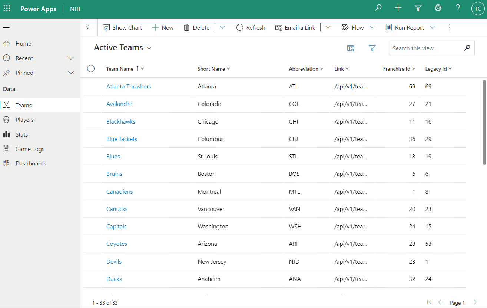
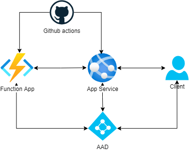

# NhlStatsCrm

- [Summary](#summary)
- [Demo](#demo)
- [Technologies](#technologies)
- [Network](#network)
- [Local Development](#local-development)
- [OpenAPI](./docs/OpenAPI.md)
- [NHL REST API Docs](#nhl-rest-api-docs)

### Summary

The purpose of this project is to take all players and stats from the NHL REST endpoint and load into Dynamics 365 on a daily basis.

There are scheduled Azure functions that will run overnight and upsert players/stats using the NHL API's id's as an alternate/foreign key.

The API supports some GET requests although this API isn't intended for use by end-users since data should be observed in Dynamics 365.

### Demo

<div>
  
</div>

### Technologies

- .NET 6
- Mediatr
- Automapper
- Microsoft Identity Platform
- CD with Github Actions
- Power Platform Dataverse Client
- Azure
  - App Service
  - Functions

### Network

<div>
  
</div>

### Local Development

If you haven't already, I highly recommend joining the Microsoft Developer Program. You will receive your own Microsoft 365 tenant which will include a Dynamics instance among many other things. So long as you continue to use this environment for development, your license will be renewed each 90 days. Check out sign-up info [HERE](https://developer.microsoft.com/en-us/microsoft-365/dev-program).

Initial project setup

- Create your appsettings.Production.json and appsettings.Development.json files. There is an example appsettings.json in the project
- Set up Azure app registration
- Create app role NhlStatsCrm.Contributor and assign to app user
- Replace values in AzureAd prop of appsettings with those from app registration
- Create your Dataverse connection string replacing default values below
- Recommend using Azure Key Vault as mechanism for passing secrets to your App Service / Function app
- Install Dynamics solution [HERE](./docs/solutions).

```javascript
{
	"AzureAd": {
		"Instance": "https://login.microsoftonline.com/",
		"Domain": "yourdomain.onmicrosoft.com",
		"TenantId": "00000000-0000-0000-0000-000000000000",
		"ClientId": "00000000-0000-0000-0000-000000000000",
		"Audience": "api://00000000-0000-0000-0000-000000000000",
		"CallbackPath": "/signin-oidc"
	},
	"ConnectionStrings": {
		"DATAVERSE": "AuthType=ClientSecret;ClientId=00000000-0000-0000-0000-000000000000;ClientSecret=gg;URL=https://yourdomain.crm.dynamics.com/;"
	},
	"Logging": {
		"LogLevel": {
			"Default": "Information",
			"Microsoft.AspNetCore": "Warning"
		}
	},
	"AllowedHosts": "*"
}
```

### NHL REST API Docs

Big thanks to the legends below. Without you all paving the way, starting projects like this would be much harder. Thank you! 🙏

- [Kevin Sidwar](https://www.kevinsidwar.com/) | Got the ball rolling

- [Jon Ursenbach](https://github.com/erunion) | Built out an [OpenAPI 3 spec](https://github.com/erunion/sport-api-specifications)

- [Drew Hynes](https://github.com/dword4) | Created and maintains the repo used in this project: [NHL REST API Repo](https://gitlab.com/dword4/nhlapi)
